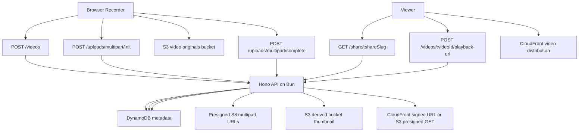
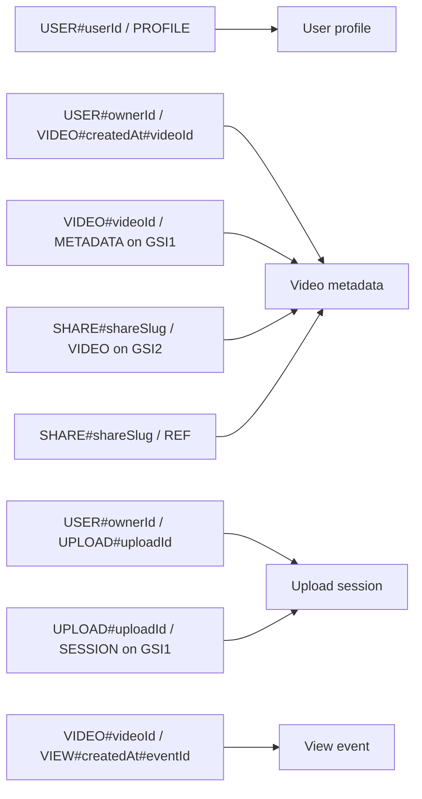

# ClipForge Architecture

# System Overview

ClipForge is a Bun monorepo built around one core rule: large video payloads never pass through the API. The browser records with native media APIs, uploads parts directly to S3 with presigned URLs, and the API only coordinates metadata, auth, access control, and playback signing.

## Upload And Playback Flow

## DynamoDB Access Patterns

## Recording Pipeline

1. The web app chooses the best supported MIME type via `MediaRecorder.isTypeSupported`.
2. Recording modes switch between screen, screen+mic, screen+camera+mic, and camera-only capture.
3. Media chunks stay in refs and never trigger React state updates per chunk.
4. A thumbnail is generated from the recorded video element with canvas APIs.
5. The upload client slices the blob, requests presigned URLs in batches, uploads with concurrency `3`, and finalizes the multipart upload.

## Binary Deployment Model

The API and CLI are both Bun-native first-class targets. The API can run as:

- `bun apps/api/src/server.ts`
- a compiled Linux binary via `bun build --compile`
- a Lambda container using the AWS Lambda Web Adapter

The CLI ships as a single compiled executable for lightweight admin workflows.

## Post-MVP Roadmap

- HLS transcoding and derived playback formats
- resumable multipart uploads via IndexedDB
- WebCodecs compression before upload
- AI transcript, summary, chapters, and speaker analysis
- team workspaces, comments, reactions, and webhook integrations
