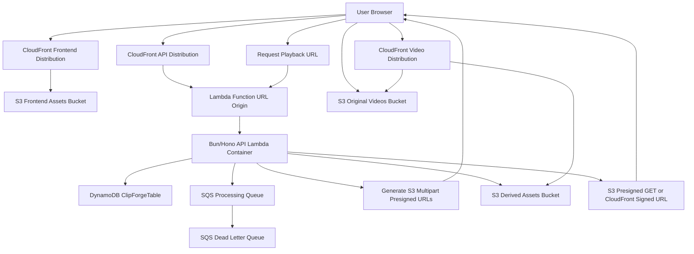

# ClipForge AWS Deployment Report

> **Deployment status:** Decommissioned on June 4, 2026. `ClipForgeStack`, `CDKToolkit`, retained S3 buckets, DynamoDB data, Route53 hosted zone, ACM certificates, CloudWatch logs, and deployment assets were deleted. Resource names and URLs below are retained as a historical deployment report.

This document explains how ClipForge was deployed on AWS, which stack/resources are used, what each resource does, and the full recording/upload/playback flow.

## Deployment Summary

ClipForge was deployed with AWS CDK in account `142517506886`, region `us-east-1`.

Former live deployment:

- Custom frontend URL: `https://clipforged.xyz`
- Custom www frontend URL: `https://www.clipforged.xyz`
- Frontend URL: `https://d1ny7x1rl0edk2.cloudfront.net`
- API URL: `https://api.clipforged.xyz`
- Lambda/API alias: `https://lambda.clipforged.xyz`
- API health URL: `https://api.clipforged.xyz/health`
- Raw Lambda Function URL: `https://xmfe23zrnivkzaomrezacvyhve0wpank.lambda-url.us-east-1.on.aws/`
- API CloudFront domain: `d397z28rh4cd34.cloudfront.net`
- DynamoDB table: `ClipForgeTable`
- Frontend assets bucket: `clipforgestack-frontendbucketefe2e19c-5wgb7faigkjr`
- Original videos bucket: `clipforgestack-videooriginalsbucketab6788dc-sypenuqjputq`
- Derived assets bucket: `clipforgestack-videoderivedbucket9bf3ffc8-52ykjlrlidcv`
- Video CloudFront domain: `ds0q4ftrevsoe.cloudfront.net`
- Route53 hosted zone: `clipforged.xyz` / `Z102718032TZCRUXUMFUO`

The deployed stack name is `ClipForgeStack`. CDK bootstrap resources were also created through the `CDKToolkit` stack.

Custom domain status: `clipforged.xyz` was purchased through Porkbun and delegated to AWS Route53 by replacing the Porkbun nameservers with the Route53 hosted-zone nameservers. CDK created DNS-validated ACM certificates in `us-east-1`, attached `clipforged.xyz` and `www.clipforged.xyz` as aliases on the frontend CloudFront distribution, attached `api.clipforged.xyz` and `lambda.clipforged.xyz` as aliases on the API CloudFront distribution, and created Route53 alias records for all four hostnames.

## What Was Deployed

The AWS infrastructure lives in `infra/lib/clipforge-stack.ts`. It defines the complete backend and hosting stack.

| AWS resource | Purpose |
| --- | --- |
| S3 frontend bucket | Stores the compiled React/Vite frontend files from `apps/web/dist`. |
| CloudFront frontend distribution | Serves the frontend publicly over HTTPS. |
| S3 original videos bucket | Stores actual uploaded screen recordings. Videos are uploaded here directly from the browser. |
| S3 derived assets bucket | Stores thumbnails and future derived media assets. |
| CloudFront video distribution | Serves original videos and thumbnails through CloudFront/S3 origin access control. |
| DynamoDB table | Stores users, video metadata, upload sessions, share references, and analytics events. |
| SQS queue | Reserved for async processing jobs such as video processing or thumbnails/transcoding. |
| SQS DLQ | Stores failed processing messages after retries. |
| Lambda container function | Runs the Bun/Hono API in AWS Lambda using AWS Lambda Web Adapter. |
| API CloudFront distribution | Public API CDN/proxy for `api.clipforged.xyz` and `lambda.clipforged.xyz`. |
| Lambda Function URL | Raw Lambda origin endpoint behind API CloudFront. |
| IAM roles/policies | Allow Lambda to read/write S3, read/write DynamoDB, send SQS messages, and write logs. |
| ECR CDK asset repository | Stores the Docker image generated by CDK for the Lambda function. |

## Account Registration And Sign-In

The app uses password-based account registration and sign-in:

- Frontend route: landing page sign-in form.
- Registration API route: `POST /auth/register`.
- Sign-in API route: `POST /auth/sign-in`.
- Dev-only compatibility route: `POST /auth/dev-login`, available only when `DEV_MODE=true`.
- Registration fields: `email`, `password`, optional `name`.
- Sign-in fields: `email`, `password`.

When a user creates an account:

1. The API derives a stable `userId` from the email.
2. The password is hashed with PBKDF2-SHA256 using a random salt.
3. The user profile and password hash are stored in DynamoDB.
4. The API returns a JWT valid for 7 days.
5. The frontend stores that session in `localStorage`.
6. All protected API requests send `Authorization: Bearer <token>`.

When a user signs in:

1. The API loads the user profile by email-derived `userId`.
2. The supplied password is verified against the stored salted hash.
3. If the password is valid, the API returns a fresh JWT session.
4. If the account does not exist or the password is wrong, the API returns `401 INVALID_CREDENTIALS`.

Different emails create different users and separate libraries. A production smoke test verified that user 1's uploaded video does not appear in user 2's library.

## Local Stack

The repo is a Bun monorepo:

| Folder | Purpose |
| --- | --- |
| `apps/web` | React + Vite frontend recorder/player/dashboard. |
| `apps/api` | Bun + Hono API for auth, videos, uploads, playback, analytics, and health. |
| `apps/worker` | Worker/Lambda-friendly processing stub for future async jobs. |
| `apps/cli` | Operational CLI commands. |
| `packages/shared` | Shared schemas, constants, and TypeScript types. |
| `infra` | AWS CDK deployment code. |

## Deployment Steps Performed

1. Verified AWS identity:

   ```powershell
   aws sts get-caller-identity
   ```

   The active user was `assignment-cdk-deploy-user` in account `142517506886`.

2. Verified local tools:

   ```powershell
   bun --version
   docker --version
   aws configure get region
   ```

   Region used: `us-east-1`.

3. Bootstrapped CDK:

   ```powershell
   bunx aws-cdk bootstrap aws://142517506886/us-east-1
   ```

   This created the `CDKToolkit` stack, including CDK asset storage and image publishing resources.

4. Fixed deployment issues in the repo:

   - Added `.dockerignore` so CDK/Docker does not copy generated output, local dependencies, local `.env`, or recursive CDK assets.
   - Added CDK Docker asset exclusions in `infra/lib/clipforge-stack.ts`.
   - Removed manual Lambda `AWS_REGION` environment variable because Lambda reserves that variable.
   - Renamed output IDs that collided with construct IDs.
   - Added `FrontendBucketName` output so frontend assets can be synced easily.
   - Made `API_BASE_URL` configurable for Lambda deployment.
   - Updated `apps/api/Dockerfile.lambda` to copy all workspace `package.json` files before `bun install --frozen-lockfile`.
   - Added Lambda AWS session-token support for DynamoDB/S3 clients. Lambda provides temporary AWS credentials with `AWS_SESSION_TOKEN`; using only access key and secret caused invalid-token errors.
   - Normalized frontend API URL joining so a trailing `API_BASE_URL` slash cannot produce routes such as `//auth/dev-login`.
   - Removed Lambda Function URL managed CORS config and kept CORS inside the Hono API only. This avoids duplicated `Access-Control-Allow-Origin` headers in browsers.

5. Deployed the first CDK stack:

   ```powershell
   $env:NODE_ENV='production'
   $env:APP_ORIGIN='http://localhost:5173'
   $env:JWT_SECRET='<32-plus-character-secret>'
   bunx aws-cdk deploy --require-approval never
   ```

   This created S3, CloudFront, DynamoDB, SQS, Lambda, IAM, and the ECR image asset.

6. Built the frontend with the real deployed API URL:

   ```powershell
   $env:API_BASE_URL='https://xmfe23zrnivkzaomrezacvyhve0wpank.lambda-url.us-east-1.on.aws/'
   $env:DEV_MODE='false'
   bun run build:web
   ```

7. Synced frontend assets to S3:

   ```powershell
   aws s3 sync apps\web\dist s3://clipforgestack-frontendbucketefe2e19c-5wgb7faigkjr --delete
   ```

8. Redeployed CDK with real production CORS/runtime values:

   ```powershell
   $env:NODE_ENV='production'
   $env:APP_ORIGIN='https://d1ny7x1rl0edk2.cloudfront.net'
   $env:API_BASE_URL='https://xmfe23zrnivkzaomrezacvyhve0wpank.lambda-url.us-east-1.on.aws/'
   $env:JWT_SECRET='<32-plus-character-secret>'
   bunx aws-cdk deploy --require-approval never
   ```

9. Invalidated the frontend CloudFront cache:

   ```powershell
   aws cloudfront create-invalidation --distribution-id E1N6TCKPCMQBVV --paths "/*"
   ```

10. Verified deployment:

   ```powershell
   Invoke-WebRequest -Uri https://xmfe23zrnivkzaomrezacvyhve0wpank.lambda-url.us-east-1.on.aws/health -UseBasicParsing
   Invoke-WebRequest -Uri https://d1ny7x1rl0edk2.cloudfront.net -UseBasicParsing
   ```

   Both returned `200 OK`.

11. Added the custom domain:

   ```powershell
   $env:NODE_ENV='production'
   $env:APP_DOMAIN_NAME='clipforged.xyz'
   $env:APP_HOSTED_ZONE_NAME='clipforged.xyz'
   $env:API_DOMAIN_NAME='api.clipforged.xyz'
   $env:LAMBDA_DOMAIN_NAME='lambda.clipforged.xyz'
   $env:APP_ORIGIN='https://clipforged.xyz,https://www.clipforged.xyz,https://d1ny7x1rl0edk2.cloudfront.net'
   $env:API_BASE_URL='https://api.clipforged.xyz'
   $env:JWT_SECRET='<32-plus-character-secret>'
   cd infra
   bunx aws-cdk deploy --require-approval never
   ```

   This created and validated the frontend ACM certificate, updated CloudFront aliases, created Route53 alias records, updated API CORS origins, and updated S3 upload CORS origins.

12. Added friendly backend domains:

   ```powershell
   $env:NODE_ENV='production'
   $env:APP_DOMAIN_NAME='clipforged.xyz'
   $env:APP_HOSTED_ZONE_NAME='clipforged.xyz'
   $env:API_DOMAIN_NAME='api.clipforged.xyz'
   $env:LAMBDA_DOMAIN_NAME='lambda.clipforged.xyz'
   $env:APP_ORIGIN='https://clipforged.xyz,https://www.clipforged.xyz,https://d1ny7x1rl0edk2.cloudfront.net'
   $env:API_BASE_URL='https://api.clipforged.xyz'
   $env:JWT_SECRET='<32-plus-character-secret>'
   cd infra
   bunx aws-cdk deploy --require-approval never
   ```

   This created an API CloudFront distribution with a DNS-validated ACM certificate for `api.clipforged.xyz` and `lambda.clipforged.xyz`, routed both names to the Lambda Function URL origin, and updated the Lambda runtime `API_BASE_URL` to the clean API domain.

13. Rebuilt the frontend against the new API domain:

   ```powershell
   $env:API_BASE_URL='https://api.clipforged.xyz'
   $env:DEV_MODE='false'
   bun run build:web
   aws s3 sync apps\web\dist s3://clipforgestack-frontendbucketefe2e19c-5wgb7faigkjr --delete
   aws cloudfront create-invalidation --distribution-id E1N6TCKPCMQBVV --paths "/*"
   ```

## Architecture Diagram

Use this Mermaid diagram for documentation, presentations, or architecture screenshots.



## Full Video Upload Flow

In production, video files do not pass through the API Lambda. This is the most important design point.

Videos are uploaded directly from the browser to S3 using presigned multipart upload URLs.

Flow:

1. User opens the app from CloudFront:

   ```text
   Browser -> Frontend CloudFront -> S3 frontend assets
   ```

2. User records screen/camera/audio in the browser using the web recorder.

3. Frontend creates video metadata:

   ```http
   POST /videos
   ```

   The API stores video metadata in DynamoDB with status `created`.

4. Frontend starts multipart upload:

   ```http
   POST /uploads/multipart/init
   ```

   The API:

   - Checks the user owns the video.
   - Checks the video MIME type and size.
   - Calls S3 `CreateMultipartUpload`.
   - Creates an upload session in DynamoDB.
   - Updates the video status to `uploading`.
   - Returns an app-level `uploadId`, S3 object key, part size, and part count.

5. The S3 object key is generated like this:

   ```text
   originals/{ownerId}/{videoId}/original.{mp4|webm|bin}
   ```

   Example shape:

   ```text
   originals/usr_abc123/vid_xyz789/original.webm
   ```

6. Frontend asks for presigned URLs in batches:

   ```http
   POST /uploads/multipart/parts
   ```

   The API returns presigned S3 `UploadPart` URLs. These URLs expire after `PRESIGNED_URL_EXPIRES_SECONDS`, currently `900` seconds by default.

7. Browser uploads each video part directly to S3:

   ```text
   Browser -> S3 original videos bucket
   ```

   The browser uses `PUT` against the presigned S3 URLs. The Lambda API is not carrying the large video bytes.

8. Frontend collects each uploaded part's `ETag`.

9. Frontend completes the upload:

   ```http
   POST /uploads/multipart/complete
   ```

   The API:

   - Loads the upload session from DynamoDB.
   - Calls S3 `CompleteMultipartUpload`.
   - Uploads the thumbnail to the derived assets bucket if provided.
   - Updates upload session status to `completed`.
   - Updates video status to `ready`.
   - Returns `shareSlug` and `videoId`.

10. If the upload is cancelled:

   ```http
   POST /uploads/multipart/abort
   ```

   The API calls S3 `AbortMultipartUpload`, marks the upload as `aborted`, and marks the video as `failed`.

## Where Videos Are Uploaded

Production videos are uploaded to:

```text
s3://clipforgestack-videooriginalsbucketab6788dc-sypenuqjputq/originals/{ownerId}/{videoId}/original.{extension}
```

Thumbnails and derived assets are uploaded to:

```text
s3://clipforgestack-videoderivedbucket9bf3ffc8-52ykjlrlidcv/thumbnails/{...}
```

The exact thumbnail key is generated by `apps/api/src/services/thumbnails.ts`.

Frontend static files are uploaded to:

```text
s3://clipforgestack-frontendbucketefe2e19c-5wgb7faigkjr/
```

## Playback Flow

Playback is coordinated by the API. The browser does not guess S3 paths directly.

Flow:

1. Viewer opens a share/playback page from the frontend.

2. Frontend loads video/share metadata from the API.

3. Frontend asks the API for a playback URL.

4. API checks:

   - Video exists.
   - Video status is playable.
   - Viewer has permission based on visibility/auth rules.
   - `originalObjectKey` is available.

5. API returns a playback URL:

   - If CloudFront signing keys are configured, the API returns a CloudFront signed URL.
   - If CloudFront signing keys are not configured, the API returns an S3 presigned GET URL.

6. Browser uses that URL to stream/download the video.

Current deployment does not configure `CLOUDFRONT_KEY_PAIR_ID` and `CLOUDFRONT_PRIVATE_KEY_BASE64`, so playback URLs are expected to use S3 presigned GET mode.

## DynamoDB Data Model

The DynamoDB table is named `ClipForgeTable`.

Primary key:

- `pk`
- `sk`

Indexes:

- `GSI1` with `gsi1pk`, `gsi1sk`
- `GSI2` with `gsi2pk`, `gsi2sk`

Main record types:

| Record type | Purpose |
| --- | --- |
| User profile | Stores user identity/profile. |
| Video metadata | Stores title, owner, size, MIME type, visibility, status, object key, share slug. |
| Upload session | Stores app upload ID, S3 upload ID, object key, part count, expiry, status. |
| Share reference | Maps share slug to video. |
| View event | Stores analytics events for playback/views. |

## S3 Bucket Details

### Frontend Assets Bucket

Stores files generated by:

```powershell
bun run build:web
```

These files are served by the frontend CloudFront distribution. The bucket blocks public access; CloudFront reads from it using origin access control.

### Original Videos Bucket

Stores real screen recordings. It is private and blocks public access.

Important config:

- CORS allows `PUT` from the frontend origin.
- Incomplete multipart uploads are aborted after 1 day.
- Objects tagged `deleted=true` expire after 7 days.
- Objects transition to S3 Intelligent-Tiering after 30 days.

### Derived Assets Bucket

Stores thumbnails and future derived media assets. It is private and accessed through API-generated URLs or CloudFront.

## Lambda API Details

The API is a Bun/Hono app running in Lambda as a Docker container.

Important files:

- API app: `apps/api/src/app.ts`
- API server: `apps/api/src/server.ts`
- Lambda Dockerfile: `apps/api/Dockerfile.lambda`
- CDK Lambda definition: `infra/lib/clipforge-stack.ts`

Runtime environment:

- `NODE_ENV=production`
- `DEV_MODE=false`
- `PORT=8080`
- `APP_ORIGIN=https://clipforged.xyz,https://www.clipforged.xyz,https://d1ny7x1rl0edk2.cloudfront.net`
- `API_BASE_URL=https://api.clipforged.xyz`
- `DYNAMODB_TABLE=ClipForgeTable`
- `VIDEO_ORIGINALS_BUCKET=<original videos bucket>`
- `VIDEO_DERIVED_BUCKET=<derived assets bucket>`
- `APP_ASSETS_BUCKET=<frontend bucket>`
- `CLOUDFRONT_VIDEO_DOMAIN=ds0q4ftrevsoe.cloudfront.net`
- `JWT_SECRET=<masked secret>`

`AWS_REGION` is not manually set because Lambda provides it automatically and reserves the variable name.

## Why Lambda Does Not Receive Video Bytes

Large recordings can be hundreds of MB or more. Sending them through Lambda would create problems:

- Lambda request payload limits.
- Higher bandwidth cost through API.
- Higher latency.
- More timeout risk.
- More memory pressure.

Instead, Lambda only issues short-lived S3 presigned URLs. The browser uploads directly to S3, and Lambda only stores metadata and finalizes the upload.

## Security Model

- S3 buckets block public access.
- CloudFront uses origin access control to read private buckets.
- API validates JWT auth for protected routes.
- Upload sessions are tied to the authenticated owner.
- Presigned upload URLs expire.
- S3 CORS only allows the deployed frontend origin after final deployment.
- JWT secret is not stored in this document.

## Cost Notes

Main costs come from:

- CloudFront requests and data transfer.
- S3 storage and requests.
- Lambda invocations/runtime.
- DynamoDB on-demand reads/writes.
- ECR image storage.
- SQS requests if async jobs are used.

The architecture is serverless, so idle cost should stay low.

## Updating The Deployment

When API or infra changes:

```powershell
$env:NODE_ENV='production'
$env:APP_DOMAIN_NAME='clipforged.xyz'
$env:APP_HOSTED_ZONE_NAME='clipforged.xyz'
$env:API_DOMAIN_NAME='api.clipforged.xyz'
$env:LAMBDA_DOMAIN_NAME='lambda.clipforged.xyz'
$env:APP_ORIGIN='https://clipforged.xyz,https://www.clipforged.xyz,https://d1ny7x1rl0edk2.cloudfront.net'
$env:API_BASE_URL='https://api.clipforged.xyz'
$env:JWT_SECRET='<32-plus-character-secret>'
cd infra
bunx aws-cdk deploy --require-approval never
```

When frontend changes:

```powershell
$env:API_BASE_URL='https://api.clipforged.xyz'
$env:FALLBACK_API_BASE_URL='https://xmfe23zrnivkzaomrezacvyhve0wpank.lambda-url.us-east-1.on.aws/'
$env:DEV_MODE='false'
bun run build:web
aws s3 sync apps\web\dist s3://clipforgestack-frontendbucketefe2e19c-5wgb7faigkjr --delete
aws cloudfront create-invalidation --distribution-id E1N6TCKPCMQBVV --paths "/*"
```

## Verification Commands

API:

```powershell
Invoke-WebRequest -Uri https://api.clipforged.xyz/health -UseBasicParsing
Invoke-WebRequest -Uri https://lambda.clipforged.xyz/health -UseBasicParsing
```

Frontend:

```powershell
Invoke-WebRequest -Uri https://clipforged.xyz -UseBasicParsing
Invoke-WebRequest -Uri https://www.clipforged.xyz -UseBasicParsing
Invoke-WebRequest -Uri https://d1ny7x1rl0edk2.cloudfront.net -UseBasicParsing
```

CloudFormation stack:

```powershell
aws cloudformation describe-stacks --stack-name ClipForgeStack
```

Lambda logs:

```powershell
aws logs tail /aws/lambda/ClipForgeStack-ApiFunctionCE271BD4-UCMkuO1VnMKp --since 15m
```

## Production Smoke Test Results

After fixing the browser login issue, these production checks were run successfully:

| Check | Result |
| --- | --- |
| DNS nameservers for `clipforged.xyz` | Route53 nameservers visible publicly |
| ACM certificate for `clipforged.xyz` / `www.clipforged.xyz` | Issued |
| Custom frontend URL `https://clipforged.xyz` | `200 OK` |
| Custom www frontend URL `https://www.clipforged.xyz` | `200 OK` |
| Frontend CloudFront HTML | `200 OK` |
| API custom domain `https://api.clipforged.xyz/health` | `200 OK` |
| Lambda/API alias `https://lambda.clipforged.xyz/health` | `200 OK` |
| Browser CORS preflight for `/auth/register` from `clipforged.xyz` | `204 No Content` |
| Browser CORS preflight for `/auth/register` from `www.clipforged.xyz` | `204 No Content` |
| Account registration with password | `201 Created` |
| Account sign-in with password | `200 OK` |
| Wrong password rejection | `401`, passed |
| Duplicate registration rejection | `409`, passed |
| Two different emails create separate users | Passed |
| User library isolation | Passed |
| Create video metadata | `201 Created` |
| Initialize S3 multipart upload | `201 Created` |
| Generate presigned upload part URL | `200 OK` |
| Upload test video part directly to S3 | S3 returned `ETag` |
| Complete multipart upload | `200 OK` |
| List authenticated user's videos | `200 OK` |
| Get video metadata | `200 OK`, status `ready` |
| Public share lookup | `200 OK`, status `ready` |
| Playback URL generation through `api.clipforged.xyz` | `200 OK`, mode `s3-presigned` |
| Fetch generated playback URL from S3 | `200 OK` |
| Frontend bundle points to `api.clipforged.xyz` | Passed |
| Frontend bundle has raw Lambda URL fallback for network-level failures | Passed |
| Patch video metadata | `200 OK` |
| Abort multipart upload | `200 OK` |
| Delete video | `200 OK` |

Smoke-test object key shape observed:

```text
originals/{userId}/{videoId}/original.webm
```

One concrete smoke-test upload stored data under:

```text
originals/usr_2c96c2d931c846eb453ca/BqQLziLmMwqTitY3vmOfB/original.webm
```

Custom-domain smoke-test account registration also passed from the `https://clipforged.xyz` origin after the domain deployment.

## Browser Login And Password Auth Notes

The screenshot error showed `Failed to fetch` during dev login. There were three underlying issues to guard against:

1. The deployed frontend had an API base URL ending in `/`, and the frontend appended `/auth/dev-login`, creating `//auth/dev-login`.
2. Lambda provides temporary AWS credentials that include `AWS_SESSION_TOKEN`; the API clients were not passing that token into explicit AWS SDK credentials.
3. Lambda Function URL CORS and Hono CORS were both setting CORS headers, which could create duplicated `Access-Control-Allow-Origin` values.

Fixes applied:

- `apps/web/src/lib/api.ts` strips trailing slashes from `env.apiBaseUrl` before appending route paths.
- `apps/web/src/lib/auth.ts` now uses `/auth/register` for account creation and `/auth/sign-in` for login.
- `apps/api/src/routes/auth.ts` exposes password-based `/auth/register` and `/auth/sign-in`.
- `apps/api/src/utils/crypto.ts` hashes passwords with salted PBKDF2-SHA256 and verifies them in constant time.
- `POST /auth/dev-login` is now restricted to development mode only.
- `apps/api/src/config/env.ts` reads optional `AWS_SESSION_TOKEN`.
- `apps/api/src/db/table.ts` and `apps/api/src/services/s3.ts` pass `sessionToken` when explicit AWS credentials are present.
- `infra/lib/clipforge-stack.ts` no longer sets Function URL CORS; `apps/api/src/middleware/cors.ts` is the single CORS source.

## Notes For Architecture Diagram Drawing

For a visual diagram, use these boxes:

1. User Browser
2. Frontend CloudFront Distribution
3. S3 Frontend Assets Bucket
4. API CloudFront Distribution
5. Lambda Function URL Origin
6. Bun/Hono API Lambda Container
7. DynamoDB `ClipForgeTable`
8. S3 Original Videos Bucket
9. S3 Derived Assets Bucket
10. Video CloudFront Distribution
11. SQS Processing Queue
12. SQS Dead Letter Queue
13. ECR/CDK Asset Repository

Use these arrows:

- Browser -> Frontend CloudFront -> S3 frontend bucket
- Browser -> API CloudFront -> Lambda Function URL -> API Lambda
- API Lambda -> DynamoDB
- API Lambda -> S3 original videos bucket for multipart init/complete/abort
- API Lambda -> Browser for presigned upload URLs
- Browser -> S3 original videos bucket for direct video part upload
- API Lambda -> S3 derived assets bucket for thumbnails
- Browser -> API Lambda for playback URL
- Browser -> Video CloudFront or S3 presigned URL for playback
- API Lambda -> SQS queue for future async processing
- SQS queue -> DLQ for failed jobs
