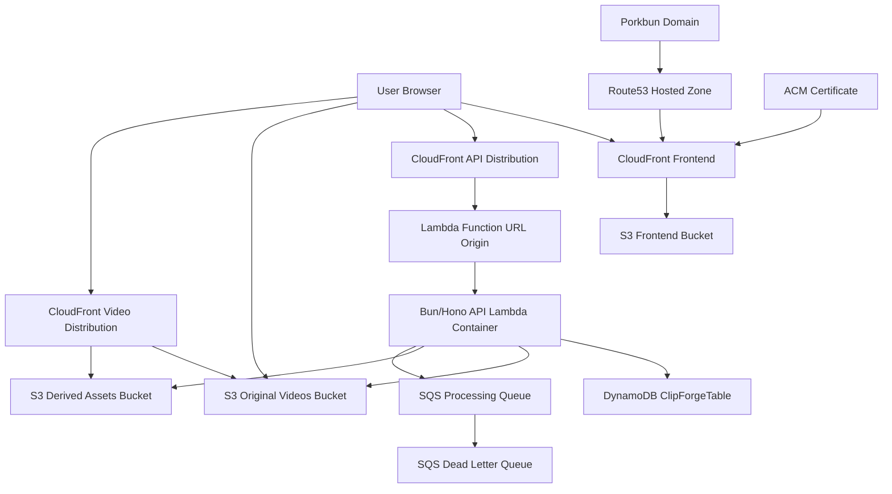

# ClipForge Project Details

> **Deployment status:** Decommissioned on June 4, 2026. The AWS stacks, application data, DNS hosted zone, certificates, logs, and CDK bootstrap resources described below were deleted. The URLs and resource names remain in this document as a historical deployment record.

ClipForge is a serverless screen-recording and video-sharing application. Users create an account, sign in with a password, record a video in the browser, upload it directly to S3, and share/play it back through signed URLs.

Former live application:

- App: `https://clipforged.xyz`
- App www alias: `https://www.clipforged.xyz`
- API: `https://api.clipforged.xyz`
- Lambda/API alias: `https://lambda.clipforged.xyz`
- Health check: `https://api.clipforged.xyz/health`

## Tech Stack

| Layer | Technology | Purpose |
| --- | --- | --- |
| Frontend | React, Vite, TypeScript | Browser UI, routing, recording, upload progress, library, playback pages. |
| Styling | Tailwind CSS | Responsive app styling. |
| Runtime/tooling | Bun | Monorepo package manager, local dev runner, TypeScript builds, API runtime. |
| API framework | Hono | HTTP routing, middleware, CORS, auth routes, video/upload/playback endpoints. |
| Auth | JWT + PBKDF2-SHA256 password hashing | Password-based accounts and authenticated API requests. |
| Database | DynamoDB | User profiles, password hashes, video metadata, upload sessions, share references, analytics events. |
| File storage | S3 | Static frontend assets, original uploaded recordings, thumbnails/derived assets. |
| CDN | CloudFront | Public HTTPS frontend delivery and private S3-origin video distribution. |
| API compute | AWS Lambda container image | Runs the Bun/Hono API through AWS Lambda Web Adapter. |
| API custom domain | CloudFront + Route53 | Proxies `api.clipforged.xyz` and `lambda.clipforged.xyz` to the Lambda Function URL. |
| Queue | SQS + DLQ | Reserved for future async video processing jobs. |
| Infrastructure | AWS CDK v2 | Defines and deploys all AWS resources. |
| CI/CD | GitHub Actions | Runs typecheck, deploys CDK, publishes frontend assets, and invalidates CloudFront on pushes to `main`. |
| Domain/DNS | Porkbun + Route53 | Porkbun domain delegates to Route53, Route53 points root/www to CloudFront. |
| Certificate | AWS Certificate Manager | HTTPS certificate for `clipforged.xyz` and `www.clipforged.xyz`. |

## Repository Structure

| Path | Purpose |
| --- | --- |
| `apps/web` | React/Vite frontend application. |
| `apps/api` | Bun/Hono API application and Lambda Dockerfile. |
| `apps/worker` | Future async processing worker stubs. |
| `apps/cli` | Operational CLI commands. |
| `packages/shared` | Shared TypeScript types, schemas, constants. |
| `infra` | AWS CDK app and stack definition. |
| `docs` | Architecture, security, cost, deployment, and project documentation. |
| `.github/workflows/deploy.yml` | GitHub Actions CI/CD workflow for production deployment. |

## AWS Architecture



## Deployed AWS Resources

| Resource | Current value | Purpose |
| --- | --- | --- |
| Stack | `ClipForgeStack` | Main application infrastructure stack. |
| Region | `us-east-1` | Deployment region. |
| Account | `142517506886` | AWS account used for deployment. |
| Route53 hosted zone | `clipforged.xyz` / `Z102718032TZCRUXUMFUO` | DNS zone for the custom domain. |
| Frontend CloudFront | `d1ny7x1rl0edk2.cloudfront.net` | Serves the React app. |
| Custom domains | `clipforged.xyz`, `www.clipforged.xyz` | Friendly HTTPS app URLs. |
| API custom domain | `api.clipforged.xyz` | Primary public backend endpoint used by the frontend. |
| Lambda/API alias | `lambda.clipforged.xyz` | Friendly alias for the Lambda-backed API. |
| API CloudFront | `d397z28rh4cd34.cloudfront.net` / `E1FSD4RL5Y7JKU` | Proxies API requests to the Lambda Function URL origin. |
| Raw Lambda Function URL | `xmfe23zrnivkzaomrezacvyhve0wpank.lambda-url.us-east-1.on.aws` | Origin endpoint behind API CloudFront. |
| DynamoDB table | `ClipForgeTable` | Main NoSQL database. |
| Frontend bucket | `clipforgestack-frontendbucketefe2e19c-5wgb7faigkjr` | Compiled Vite static files. |
| Original videos bucket | `clipforgestack-videooriginalsbucketab6788dc-sypenuqjputq` | Raw uploaded recordings. |
| Derived assets bucket | `clipforgestack-videoderivedbucket9bf3ffc8-52ykjlrlidcv` | Thumbnails and derived media. |
| Video CloudFront | `ds0q4ftrevsoe.cloudfront.net` | CDN for private video/thumbnail origins. |
| SQS queue | CDK-created processing queue | Future video processing jobs. |
| SQS DLQ | CDK-created dead-letter queue | Failed processing messages. |

## Domain Flow

The domain was purchased in Porkbun, but DNS is managed by AWS Route53.

1. Porkbun nameservers were replaced with the Route53 nameservers:

   ```text
   ns-196.awsdns-24.com
   ns-1824.awsdns-36.co.uk
   ns-777.awsdns-33.net
   ns-1404.awsdns-47.org
   ```

2. CDK looks up the Route53 hosted zone `clipforged.xyz`.
3. CDK creates an ACM certificate in `us-east-1` for:

   ```text
   clipforged.xyz
   www.clipforged.xyz
   ```

4. ACM validates ownership by creating DNS validation records in Route53.
5. CloudFront uses that certificate and accepts both custom domains.
6. Route53 creates alias A records from root and www to CloudFront.
7. CDK also creates an API CloudFront distribution and aliases `api.clipforged.xyz` and `lambda.clipforged.xyz` to it.
8. The frontend is built with `API_BASE_URL=https://api.clipforged.xyz`, so browser API calls use the clean API domain.

## Authentication And Password Flow

The app now supports real account creation and sign-in with passwords. Users are not limited to a hardcoded demo account.

Registration endpoint:

```http
POST /auth/register
```

Sign-in endpoint:

```http
POST /auth/sign-in
```

Registration body:

```json
{
  "email": "user@example.com",
  "password": "user-password",
  "name": "Optional Name"
}
```

Sign-in body:

```json
{
  "email": "user@example.com",
  "password": "user-password"
}
```

Password handling:

1. User enters email/password in the frontend.
2. Frontend sends the password only over HTTPS to the API.
3. API normalizes the email and derives a stable user ID from it.
4. API hashes the password using salted PBKDF2-SHA256.
5. The plain password is never stored.
6. DynamoDB stores the user profile and password hash.
7. On sign-in, API loads the DynamoDB user record and verifies the submitted password against the stored salted hash.
8. If it matches, API signs a JWT.
9. Frontend stores the returned session in `localStorage`.
10. Protected API calls send:

   ```http
   Authorization: Bearer <jwt>
   ```

Where the password goes:

- Browser: user enters password.
- API Lambda: password is received for registration/sign-in only.
- DynamoDB: stores only the password hash, not the original password.
- JWT: contains user/session identity, not the password.

Where matching happens on AWS:

- The Bun/Hono API runs inside Lambda.
- Lambda reads the user record from DynamoDB.
- Lambda verifies the submitted password with the stored salted hash.
- Lambda returns `401 INVALID_CREDENTIALS` for missing account or wrong password.

## Database Design

Database: DynamoDB table `ClipForgeTable`.

Primary key:

- `pk`
- `sk`

Indexes:

- `GSI1`: `gsi1pk`, `gsi1sk`
- `GSI2`: `gsi2pk`, `gsi2sk`

Main record types:

| Record type | Stored data | Used for |
| --- | --- | --- |
| User profile | User ID, email, name, password hash, timestamps | Auth and account identity. |
| Video metadata | Video ID, owner ID, title, MIME type, size, status, S3 object key, share slug | Library, playback, sharing. |
| Upload session | App upload ID, S3 multipart upload ID, object key, part size, status | Multipart upload lifecycle. |
| Share reference | Share slug to video mapping | Public share lookup. |
| View event | Playback/view analytics data | Basic analytics tracking. |

Why DynamoDB:

- Serverless and low idle cost.
- Fast key-value access for user/video/session lookups.
- On-demand billing avoids capacity planning for this project.
- Global secondary indexes support library and share lookup access patterns.

## Video Upload Flow

Video bytes do not pass through Lambda. Lambda only creates upload metadata and presigned URLs.

1. User records screen/camera/audio in the browser.
2. Frontend creates a video metadata row:

   ```http
   POST /videos
   ```

3. Frontend starts multipart upload:

   ```http
   POST /uploads/multipart/init
   ```

4. Lambda checks ownership and allowed size/type.
5. Lambda calls S3 `CreateMultipartUpload`.
6. Lambda stores the upload session in DynamoDB.
7. Lambda returns app upload ID, object key, part size, and part count.
8. Frontend asks for upload part URLs:

   ```http
   POST /uploads/multipart/parts
   ```

9. Lambda returns short-lived S3 presigned `UploadPart` URLs.
10. Browser uploads video chunks directly to S3.
11. Frontend sends ETags back to complete:

   ```http
   POST /uploads/multipart/complete
   ```

12. Lambda calls S3 `CompleteMultipartUpload`, saves thumbnail/derived data, and marks the video `ready`.

Object key format:

```text
originals/{ownerId}/{videoId}/original.{extension}
```

Production upload bucket:

```text
s3://clipforgestack-videooriginalsbucketab6788dc-sypenuqjputq/originals/{ownerId}/{videoId}/original.{extension}
```

## Playback Flow

1. Viewer opens a share/playback route in the frontend.
2. Frontend loads video/share metadata from the API.
3. Frontend asks the API for a playback URL.
4. Lambda checks video status and access rules.
5. Lambda returns a signed playback URL.
6. Browser streams the video from S3/CloudFront.

Current deployment uses S3 presigned GET URLs for playback because CloudFront signing keys are not configured:

```text
CLOUDFRONT_KEY_PAIR_ID=
CLOUDFRONT_PRIVATE_KEY_BASE64=
```

## API Routes

| Route | Purpose |
| --- | --- |
| `GET /health` | Runtime health check. |
| `POST /auth/register` | Create account with email/password. |
| `POST /auth/sign-in` | Sign in with email/password. |
| `POST /auth/dev-login` | Dev-only login when `DEV_MODE=true`. |
| `GET /videos` | List authenticated user's videos. |
| `POST /videos` | Create video metadata. |
| `GET /videos/:videoId` | Get a video's metadata. |
| `PATCH /videos/:videoId` | Update video metadata. |
| `DELETE /videos/:videoId` | Delete/mark video deleted. |
| `POST /uploads/multipart/init` | Start multipart upload. |
| `POST /uploads/multipart/parts` | Generate presigned upload part URLs. |
| `POST /uploads/multipart/complete` | Complete multipart upload. |
| `POST /uploads/multipart/abort` | Abort multipart upload. |

## Environment Variables

API/Lambda:

| Variable | Purpose |
| --- | --- |
| `NODE_ENV` | `development`, `test`, or `production`. |
| `DEV_MODE` | Enables local/dev behavior such as dev login. |
| `PORT` | API port locally; Lambda uses `8080`. |
| `APP_ORIGIN` | Comma-separated allowed browser origins for CORS. |
| `API_BASE_URL` | Public API URL used by frontend/build config. |
| `AWS_REGION` | Region for local AWS SDK clients; Lambda provides it automatically. |
| `AWS_ACCESS_KEY_ID`, `AWS_SECRET_ACCESS_KEY`, `AWS_SESSION_TOKEN` | Optional explicit local AWS credentials. Lambda uses IAM role credentials. |
| `DYNAMODB_TABLE` | DynamoDB table name. |
| `VIDEO_ORIGINALS_BUCKET` | S3 bucket for original recordings. |
| `VIDEO_DERIVED_BUCKET` | S3 bucket for thumbnails/derived assets. |
| `APP_ASSETS_BUCKET` | S3 bucket for frontend assets. |
| `CLOUDFRONT_VIDEO_DOMAIN` | Video CloudFront domain. |
| `CLOUDFRONT_KEY_PAIR_ID`, `CLOUDFRONT_PRIVATE_KEY_BASE64` | Optional CloudFront signed URL config. |
| `JWT_SECRET` | Secret for signing JWTs; at least 32 characters in production. |
| `MAX_UPLOAD_BYTES` | Maximum upload size. |
| `PRESIGNED_URL_EXPIRES_SECONDS` | Presigned URL expiry. |
| `UPLOAD_PART_SIZE_BYTES` | Multipart upload part size. |

Frontend build variables:

| Variable | Purpose |
| --- | --- |
| `API_BASE_URL` | API URL compiled into the Vite app. |
| `FALLBACK_API_BASE_URL` | Optional fallback API URL used only if the primary API domain has a network-level failure. |
| `DEV_MODE` | Frontend dev-mode flag compiled into the Vite app. |

## Local Run Commands

Install dependencies:

```powershell
bun install
```

Copy env example:

```powershell
Copy-Item .env.example .env
```

Edit `.env` for local development. At minimum:

```text
NODE_ENV=development
DEV_MODE=true
PORT=3000
APP_ORIGIN=http://localhost:5173
API_BASE_URL=http://localhost:3000
JWT_SECRET=replace-me-with-a-32-plus-char-secret
```

Run API locally:

```powershell
bun run dev:api
```

Run frontend locally:

```powershell
bun run dev:web
```

Run both workspaces:

```powershell
bun run dev
```

Type-check all packages:

```powershell
bun run typecheck
```

Build frontend:

```powershell
$env:API_BASE_URL='http://localhost:3000'
$env:DEV_MODE='true'
bun run build:web
```

Build API:

```powershell
bun run build:api
```

Build Lambda Docker image locally:

```powershell
docker build -f apps/api/Dockerfile.lambda -t clipforge-api-lambda .
```

## AWS Deploy Commands

Production deployment is now automated with GitHub Actions. See `docs/CI_CD.md`.

Deploy infrastructure with custom domain:

```powershell
cd infra
$env:NODE_ENV='production'
$env:APP_DOMAIN_NAME='clipforged.xyz'
$env:APP_HOSTED_ZONE_NAME='clipforged.xyz'
$env:API_DOMAIN_NAME='api.clipforged.xyz'
$env:LAMBDA_DOMAIN_NAME='lambda.clipforged.xyz'
$env:APP_ORIGIN='https://clipforged.xyz,https://www.clipforged.xyz,https://d1ny7x1rl0edk2.cloudfront.net'
$env:API_BASE_URL='https://api.clipforged.xyz'
$env:JWT_SECRET='<32-plus-character-secret>'
bunx aws-cdk deploy --require-approval never
```

Build and upload frontend:

```powershell
cd ..
$env:API_BASE_URL='https://api.clipforged.xyz'
$env:FALLBACK_API_BASE_URL='https://xmfe23zrnivkzaomrezacvyhve0wpank.lambda-url.us-east-1.on.aws/'
$env:DEV_MODE='false'
bun run build:web
aws s3 sync apps\web\dist s3://clipforgestack-frontendbucketefe2e19c-5wgb7faigkjr --delete
aws cloudfront create-invalidation --distribution-id E1N6TCKPCMQBVV --paths "/*"
```

Verify deployment:

```powershell
Invoke-WebRequest -Uri https://clipforged.xyz -UseBasicParsing
Invoke-WebRequest -Uri https://www.clipforged.xyz -UseBasicParsing
Invoke-WebRequest -Uri https://api.clipforged.xyz/health -UseBasicParsing
Invoke-WebRequest -Uri https://lambda.clipforged.xyz/health -UseBasicParsing
```

## Git Commands

Check changes:

```powershell
git status
```

Commit changes:

```powershell
git add .
git commit -m "Document ClipForge deployment and project architecture"
```

Push to GitHub:

```powershell
git push origin main
```

If the local branch is not `main`, use:

```powershell
git branch --show-current
git push origin <branch-name>
```

## Security Notes

- Passwords are never stored in plain text.
- JWT secret must not be committed to GitHub.
- `.dockerignore` excludes `.env` and generated folders from Docker/CDK assets.
- S3 buckets block public access.
- CloudFront reads private S3 buckets using origin access control.
- Upload URLs are short-lived.
- CORS is restricted to the deployed frontend origins.
- Lambda uses IAM role permissions in AWS instead of static AWS keys.

## Current Smoke Test Status

The deployed app was tested after custom-domain deployment:

| Check | Result |
| --- | --- |
| `https://clipforged.xyz` | `200 OK` |
| `https://www.clipforged.xyz` | `200 OK` |
| `https://api.clipforged.xyz/health` | `200 OK` |
| `https://lambda.clipforged.xyz/health` | `200 OK` |
| CORS from root domain | `204 No Content` |
| CORS from www domain | `204 No Content` |
| Account registration | `201 Created` |
| Account sign-in | `200 OK` |
| Wrong password rejection | `401` |
| Multipart upload/playback through `api.clipforged.xyz` | Passed |
| Frontend API fallback for network-level API domain failures | Enabled |
